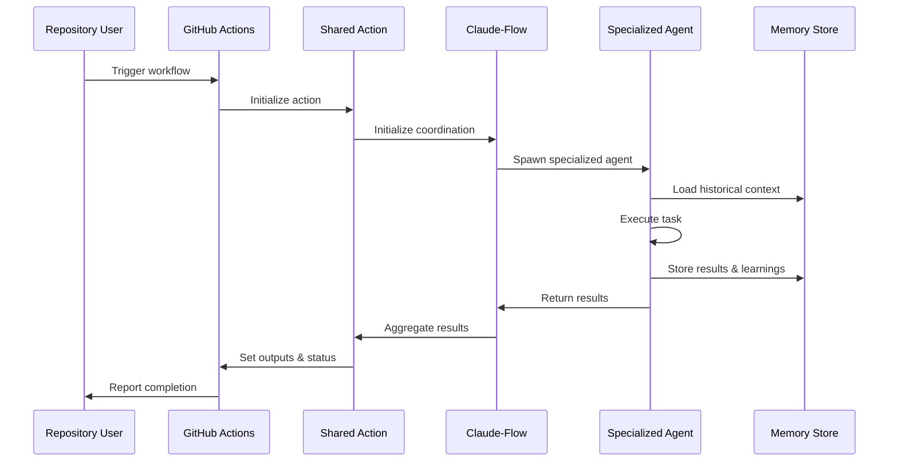
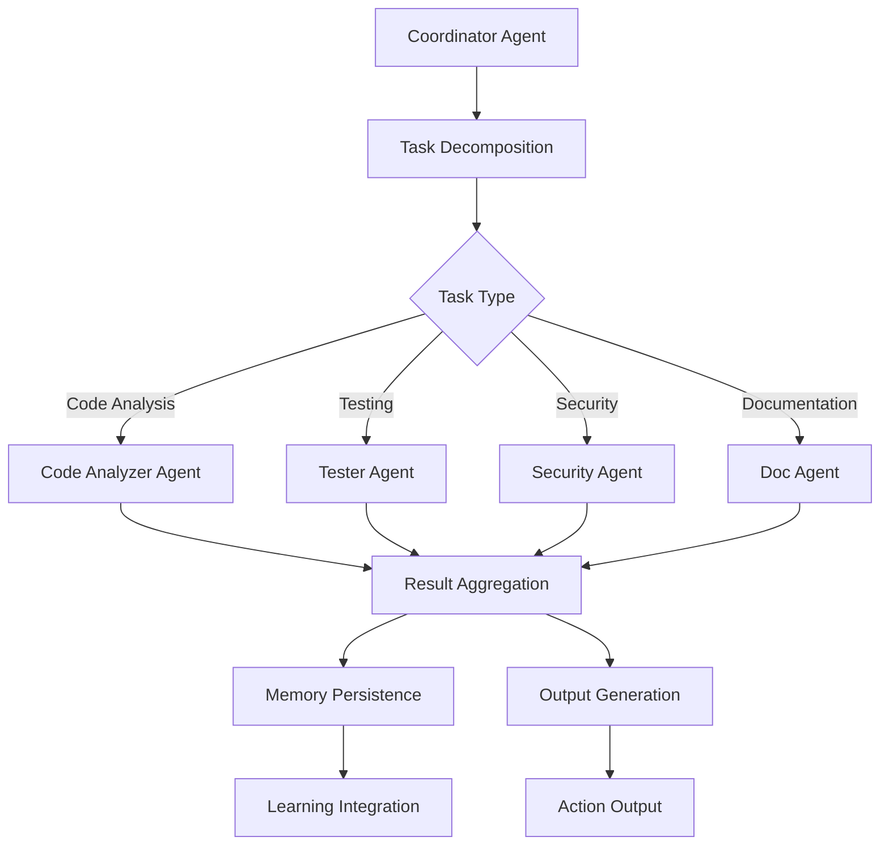
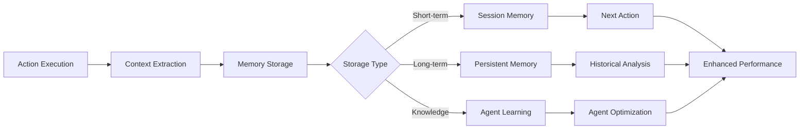

# Component Interaction Patterns
## Shared GitHub Actions Architecture

### Overview

This document defines the interaction patterns between components in the Shared GitHub Actions system, focusing on data flow, communication protocols, and integration points with Claude-Flow orchestration.

---

## Core Interaction Patterns

### 1. Action Lifecycle Pattern



### 2. Agent Coordination Pattern



### 3. Memory Management Pattern



---

## Detailed Component Interactions

### GitHub Actions Runner Integration

#### Input/Output Flow
```typescript
interface ActionInputs {
  // Standard GitHub Actions inputs
  repository: string;
  token: string;
  
  // Claude-Flow specific inputs
  agentTypes: string[];
  swarmTopology: 'hierarchical' | 'mesh' | 'star';
  memoryNamespace: string;
  
  // Action-specific inputs
  [key: string]: any;
}

interface ActionOutputs {
  // Standard outputs
  success: boolean;
  status: string;
  
  // Results and reports
  results: ActionResult[];
  reports: Report[];
  
  // Claude-Flow coordination data
  agentMetrics: AgentMetrics;
  memoryUpdates: MemoryUpdate[];
  
  // Action-specific outputs
  [key: string]: any;
}
```

#### Execution Context
```typescript
class ActionContext {
  readonly github: GitHubContext;
  readonly claudeFlow: ClaudeFlowCoordinator;
  readonly memory: MemoryManager;
  readonly config: ActionConfig;

  constructor(inputs: ActionInputs) {
    this.github = new GitHubContext(inputs.token);
    this.claudeFlow = new ClaudeFlowCoordinator(inputs.swarmTopology);
    this.memory = new MemoryManager(inputs.memoryNamespace);
    this.config = ActionConfig.from(inputs);
  }
}
```

### Claude-Flow Coordination Layer

#### Swarm Initialization
```typescript
interface SwarmInitialization {
  topology: SwarmTopology;
  maxAgents: number;
  strategy: 'balanced' | 'specialized' | 'adaptive';
  
  // Memory configuration
  memoryPersistence: boolean;
  sessionId: string;
  namespace: string;
}

class ClaudeFlowCoordinator {
  async initializeSwarm(config: SwarmInitialization): Promise<SwarmId> {
    // Initialize swarm with specified topology
    const swarmId = await mcp.swarm_init({
      topology: config.topology,
      maxAgents: config.maxAgents,
      strategy: config.strategy
    });
    
    // Configure memory persistence
    await mcp.memory_usage({
      action: 'store',
      namespace: config.namespace,
      key: 'swarm_config',
      value: JSON.stringify(config)
    });
    
    return swarmId;
  }
}
```

#### Agent Spawning Strategy
```typescript
interface AgentSpawningStrategy {
  determineAgentTypes(task: Task): AgentType[];
  calculateResourceRequirements(agents: AgentType[]): ResourceRequirements;
  optimizeAgentDistribution(swarmTopology: SwarmTopology): AgentDistribution;
}

class AdaptiveSpawningStrategy implements AgentSpawningStrategy {
  determineAgentTypes(task: Task): AgentType[] {
    const agentTypes: AgentType[] = [];
    
    if (task.involves.codeAnalysis) agentTypes.push('code-analyzer');
    if (task.involves.testing) agentTypes.push('tester');
    if (task.involves.security) agentTypes.push('security-scanner');
    if (task.involves.documentation) agentTypes.push('documenter');
    
    return agentTypes;
  }
}
```

### Memory and Learning Integration

#### Memory Storage Pattern
```typescript
interface MemoryEntry {
  id: string;
  namespace: string;
  timestamp: Date;
  context: ExecutionContext;
  results: ActionResult[];
  learnings: LearningData[];
  metadata: Record<string, any>;
}

class MemoryManager {
  async storeExecution(entry: MemoryEntry): Promise<void> {
    // Store execution context
    await mcp.memory_usage({
      action: 'store',
      namespace: entry.namespace,
      key: `execution_${entry.id}`,
      value: JSON.stringify(entry),
      ttl: this.calculateTTL(entry.context)
    });
    
    // Update learning patterns
    await this.updateLearningPatterns(entry.learnings);
  }
  
  async retrieveHistoricalContext(task: Task): Promise<MemoryEntry[]> {
    const pattern = this.buildSearchPattern(task);
    return await mcp.memory_search({
      pattern,
      namespace: task.namespace,
      limit: 10
    });
  }
}
```

#### Learning Integration Pattern
```typescript
interface LearningData {
  pattern: string;
  success: boolean;
  performance: PerformanceMetrics;
  context: TaskContext;
  improvements: string[];
}

class LearningEngine {
  async analyzeExecution(results: ActionResult[]): Promise<LearningData[]> {
    const learnings: LearningData[] = [];
    
    for (const result of results) {
      const pattern = this.extractPattern(result);
      const learning: LearningData = {
        pattern,
        success: result.success,
        performance: result.metrics,
        context: result.context,
        improvements: await this.suggestImprovements(result)
      };
      
      learnings.push(learning);
    }
    
    return learnings;
  }
  
  async applyLearnings(task: Task): Promise<TaskOptimization[]> {
    const historicalData = await this.memoryManager.retrieveHistoricalContext(task);
    return this.optimizeBasedOnHistory(task, historicalData);
  }
}
```

---

## Integration Protocols

### GitHub API Integration

#### Authentication Flow
```typescript
class GitHubAPIIntegration {
  private octokit: Octokit;
  
  constructor(token: string) {
    this.octokit = new Octokit({ auth: token });
  }
  
  async createCheckRun(params: CheckRunParams): Promise<CheckRun> {
    return await this.octokit.rest.checks.create({
      owner: params.owner,
      repo: params.repo,
      name: params.name,
      head_sha: params.sha,
      status: 'in_progress',
      details_url: params.detailsUrl,
      external_id: params.externalId
    });
  }
  
  async updateCheckRun(params: UpdateCheckRunParams): Promise<void> {
    await this.octokit.rest.checks.update({
      owner: params.owner,
      repo: params.repo,
      check_run_id: params.checkRunId,
      status: 'completed',
      conclusion: params.conclusion,
      output: {
        title: params.title,
        summary: params.summary,
        annotations: params.annotations
      }
    });
  }
}
```

### Error Handling and Recovery

#### Error Propagation Pattern
```typescript
class ErrorHandler {
  async handleAgentFailure(agent: Agent, error: Error): Promise<RecoveryAction> {
    // Log error for analysis
    await this.logError(agent.id, error);
    
    // Determine recovery strategy
    const strategy = await this.determineRecoveryStrategy(agent, error);
    
    switch (strategy.type) {
      case 'retry':
        return this.scheduleRetry(agent, strategy.params);
      case 'fallback':
        return this.activateFallbackAgent(agent, strategy.params);
      case 'graceful_degradation':
        return this.enableGracefulDegradation(agent, strategy.params);
      default:
        return this.failAction(error);
    }
  }
  
  async handleSwarmFailure(swarmId: string, error: SwarmError): Promise<void> {
    // Attempt swarm recovery
    const recoverable = await this.assessSwarmRecoverability(swarmId, error);
    
    if (recoverable) {
      await this.restoreSwarmFromCheckpoint(swarmId);
    } else {
      await this.initializeBackupSwarm(swarmId);
    }
  }
}
```

---

## Performance Optimization Patterns

### Caching Strategy
```typescript
interface CacheStrategy {
  level: 'action' | 'agent' | 'swarm';
  duration: number;
  invalidationRules: CacheInvalidationRule[];
  compressionEnabled: boolean;
}

class PerformanceOptimizer {
  async optimizeActionExecution(action: Action): Promise<OptimizationPlan> {
    const historicalData = await this.getHistoricalPerformance(action);
    const bottlenecks = await this.identifyBottlenecks(historicalData);
    
    return {
      cacheStrategy: this.determineCacheStrategy(action, bottlenecks),
      agentOptimization: this.optimizeAgentAllocation(action, bottlenecks),
      resourceOptimization: this.optimizeResourceUsage(action, bottlenecks)
    };
  }
  
  async monitorPerformance(execution: ActionExecution): Promise<PerformanceMetrics> {
    return {
      executionTime: execution.endTime - execution.startTime,
      memoryUsage: await this.measureMemoryUsage(execution),
      agentEfficiency: await this.calculateAgentEfficiency(execution.agents),
      cacheHitRate: await this.calculateCacheHitRate(execution.cacheAccess)
    };
  }
}
```

---

## Security and Compliance Patterns

### Secure Communication
```typescript
class SecureCommunicationLayer {
  async encryptSensitiveData(data: any): Promise<EncryptedData> {
    return await this.encryption.encrypt(JSON.stringify(data));
  }
  
  async auditAgentCommunication(communication: AgentCommunication): Promise<void> {
    await this.auditLogger.log({
      timestamp: new Date(),
      from: communication.from,
      to: communication.to,
      messageHash: this.hash(communication.message),
      classification: this.classifyMessage(communication.message)
    });
  }
}
```

These interaction patterns provide a comprehensive framework for building scalable, maintainable, and high-performance shared GitHub Actions with advanced Claude-Flow integration.