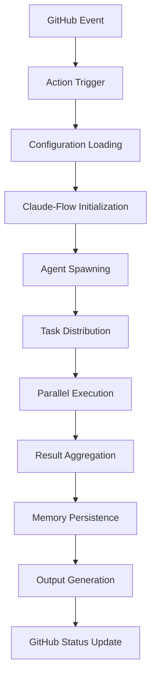
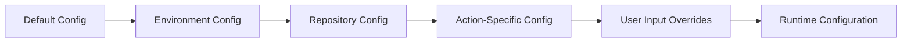
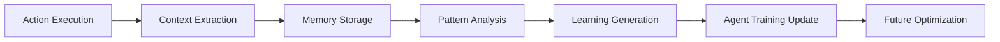

# System Architecture Overview
## Shared GitHub Actions Repository

### Executive Summary

This document provides a comprehensive overview of the Shared GitHub Actions repository architecture, designed to support enterprise-grade reusable actions with advanced Claude-Flow integration. The architecture emphasizes scalability, maintainability, and performance while providing sophisticated agent coordination capabilities.

---

## Architecture Principles

### 1. **Domain-Driven Design**
- Actions organized by functional domains (code quality, security, testing)
- Clear bounded contexts between different action types
- Shared utilities centralized for reusability

### 2. **Separation of Concerns**
- Distinct layers for presentation, business logic, and infrastructure
- Action types separated by implementation approach (composite, JavaScript, Docker)
- Configuration management isolated from business logic

### 3. **Scalability First**
- Horizontal scaling through agent coordination
- Efficient resource utilization with caching strategies
- Performance optimization at all levels

### 4. **Security by Design**
- Secure secret management with audit trails
- Principle of least privilege access
- Comprehensive security scanning and compliance checking

### 5. **Observability and Monitoring**
- Comprehensive logging and metrics collection
- Performance monitoring and alerting
- Agent coordination tracking and optimization

---

## High-Level System Architecture

```
┌─────────────────────────────────────────────────────────────────────────┐
│                           GitHub Actions Platform                        │
└─────────────────────────┬───────────────────────────────────────────────┘
                          │
┌─────────────────────────▼───────────────────────────────────────────────┐
│                    Shared Actions Repository                             │
│  ┌─────────────────┐  ┌──────────────────┐  ┌─────────────────────────┐  │
│  │   Composite     │  │   JavaScript     │  │      Docker Actions     │  │
│  │   Actions       │  │   Actions        │  │                         │  │
│  │                 │  │                  │  │                         │  │
│  │ • Workflow      │  │ • PR Analysis    │  │ • Security Scanning     │  │
│  │   Orchestration │  │ • Issue Triage   │  │ • Multi-lang Linting    │  │
│  │ • Code Quality  │  │ • Release Mgmt   │  │ • Compliance Checking   │  │
│  │   Suites        │  │ • Metrics        │  │ • Custom Tools          │  │
│  └─────────────────┘  └──────────────────┘  └─────────────────────────┘  │
│                                    │                                     │
│  ┌────────────────────────────────────────────────────────────────────┐  │
│  │                    Shared Utilities Layer                         │  │
│  │                                                                    │  │
│  │ • GitHub API Integration    • Configuration Management            │  │
│  │ • Logging & Metrics        • Error Handling & Recovery           │  │
│  │ • Validation & Security    • Performance Optimization            │  │
│  └────────────────────────────────────────────────────────────────────┘  │
└─────────────────────────┬───────────────────────────────────────────────┘
                          │
┌─────────────────────────▼───────────────────────────────────────────────┐
│                      Claude-Flow Integration                             │
│                                                                          │
│  ┌─────────────────┐  ┌──────────────────┐  ┌─────────────────────────┐  │
│  │     Swarm       │  │      Agent       │  │       Memory            │  │
│  │  Coordination   │  │   Management     │  │     Management          │  │
│  │                 │  │                  │  │                         │  │
│  │ • Topology Mgmt │  │ • Agent Spawning │  │ • Persistent Storage    │  │
│  │ • Load Balancing│  │ • Task Dist.     │  │ • Learning Integration  │  │
│  │ • Fault Tolerance│ │ • Result Aggreg. │  │ • Context Sharing       │  │
│  └─────────────────┘  └──────────────────┘  └─────────────────────────┘  │
└─────────────────────────────────────────────────────────────────────────┘
```

---

## Component Architecture

### Action Types Architecture

#### Composite Actions (YAML-based)
```yaml
Purpose: Workflow orchestration and step sequencing
Technology: YAML + Shell scripts
Use Cases:
  - Multi-step quality checks
  - Workflow automation
  - Simple integrations
Benefits:
  - Easy to read and modify
  - No build step required
  - Direct runner access
```

#### JavaScript Actions (Node.js)
```typescript
Purpose: Complex logic and GitHub API integration
Technology: TypeScript/Node.js
Use Cases:
  - PR analysis and automation
  - Issue triage and management
  - Real-time data processing
Benefits:
  - Rich ecosystem access
  - Performance optimization
  - Advanced GitHub API features
```

#### Docker Actions (Container-based)
```dockerfile
Purpose: Isolated environments and specialized tools
Technology: Docker + Multiple languages
Use Cases:
  - Security scanning
  - Multi-language support
  - Legacy tool integration
Benefits:
  - Complete environment control
  - Language flexibility
  - Tool isolation
```

### Claude-Flow Integration Architecture

#### Swarm Coordination Layer
```
Coordinator Agent
├── Task Decomposition Engine
├── Agent Spawning Manager
├── Resource Allocation System
├── Result Aggregation Service
└── Performance Monitor
```

#### Agent Management System
```
Agent Registry
├── Agent Type Definitions
├── Capability Mapping
├── Resource Requirements
├── Performance Metrics
└── Health Monitoring
```

#### Memory Management Architecture
```
Memory Store
├── Session Memory (Temporary)
├── Persistent Memory (Long-term)
├── Learning Data (Agent Training)
├── Configuration Cache
└── Performance Metrics
```

---

## Data Flow Architecture

### Action Execution Flow


### Configuration Hierarchy


### Memory and Learning Flow


---

## Quality Attributes

### Performance Characteristics
- **Action Startup**: < 30 seconds
- **Small Repository Processing**: < 2 minutes
- **Medium Repository Processing**: < 5 minutes
- **Large Repository Processing**: < 10 minutes
- **Agent Coordination Overhead**: < 10%

### Scalability Metrics
- **Concurrent Workflows**: 100+ simultaneous executions
- **Repository Size Support**: Up to 1GB repositories
- **File Change Processing**: 1000+ files per PR
- **Active Agents**: 50+ coordinated agents
- **Memory Retention**: 30 days of execution data

### Reliability Standards
- **Uptime Target**: 99.9% for critical actions
- **Error Recovery**: Automatic retry with exponential backoff
- **Fallback Mechanisms**: Graceful degradation on failures
- **Data Durability**: 99.99% memory persistence reliability

### Security Measures
- **Secret Management**: Encrypted storage with audit trails
- **Access Control**: Role-based permissions with least privilege
- **Vulnerability Scanning**: Automated security analysis
- **Compliance**: SOC2, GDPR, NIST-RMF, CMMC-L3 alignment

---

## Technology Stack

### Core Technologies
- **GitHub Actions**: Primary execution platform
- **Node.js 18+**: JavaScript action runtime
- **TypeScript**: Type-safe development
- **Docker**: Container-based actions
- **Claude-Flow**: Agent coordination framework

### Development Tools
- **Jest**: Testing framework
- **ESLint/Prettier**: Code quality tools
- **Webpack**: JavaScript bundling
- **GitHub CLI**: Repository management
- **Act**: Local GitHub Actions testing

### Infrastructure Components
- **GitHub API**: Platform integration
- **npm Registry**: Package distribution
- **Docker Hub**: Container image storage
- **Redis**: Caching layer (Claude-Flow)
- **PostgreSQL**: Memory persistence (Claude-Flow)

---

## Security Architecture

### Security Layers
```
┌─────────────────────────────────────┐
│         Application Security        │
│ • Input validation                  │
│ • Output sanitization               │
│ • Error handling                    │
└─────────────────────────────────────┘
┌─────────────────────────────────────┐
│          Access Control             │
│ • GitHub token validation           │
│ • Permission verification           │
│ • Audit logging                     │
└─────────────────────────────────────┘
┌─────────────────────────────────────┐
│           Data Security             │
│ • Secret encryption                 │
│ • Secure transmission               │
│ • Data classification               │
└─────────────────────────────────────┘
┌─────────────────────────────────────┐
│        Infrastructure Security      │
│ • Container isolation               │
│ • Network security                  │
│ • Resource limitations              │
└─────────────────────────────────────┘
```

### Threat Model
- **Malicious Code Injection**: Input validation and sandboxing
- **Secret Exposure**: Encrypted storage and access controls
- **Privilege Escalation**: Least privilege principles
- **Data Exfiltration**: Audit logging and monitoring
- **Supply Chain Attacks**: Dependency scanning and validation

---

## Monitoring and Observability

### Metrics Collection
```typescript
interface SystemMetrics {
  performance: {
    executionTime: number;
    memoryUsage: number;
    cpuUtilization: number;
    cacheHitRate: number;
  };
  reliability: {
    successRate: number;
    errorRate: number;
    retryCount: number;
    recoveryTime: number;
  };
  scalability: {
    concurrentExecutions: number;
    queueLength: number;
    resourceUtilization: number;
    throughput: number;
  };
  claudeFlow: {
    agentEfficiency: number;
    coordinationOverhead: number;
    memoryUtilization: number;
    learningProgress: number;
  };
}
```

### Alerting Strategy
- **Performance Degradation**: > 2x baseline execution time
- **High Error Rate**: > 5% failure rate over 10 minutes
- **Resource Exhaustion**: > 90% memory or CPU utilization
- **Security Events**: Unauthorized access attempts
- **Agent Failures**: > 20% agent failure rate

---

## Deployment Architecture

### Release Strategy
```
Development → Staging → Production
     ↓           ↓          ↓
  • Feature    • Integration • Full
    branches     testing      deployment
  • Unit       • Performance • Monitoring
    testing      validation   & alerts
  • Code       • Security    • Rollback
    review       scanning     capability
```

### Version Management
- **Semantic Versioning**: MAJOR.MINOR.PATCH format
- **Branch Strategy**: GitFlow with release branches
- **Tag Management**: Automated tagging with version aliases
- **Rollback Support**: Automated rollback on failure detection

### Infrastructure Requirements
- **GitHub Actions Runners**: Ubuntu, Windows, macOS support
- **Node.js Versions**: 16.x, 18.x, 20.x compatibility
- **Docker Support**: Container execution capability
- **Network Access**: GitHub API and external service connectivity

---

## Future Architecture Considerations

### Planned Enhancements
- **Multi-Platform Support**: GitLab CI/CD and Bitbucket Pipelines
- **Enhanced AI Features**: Advanced pattern recognition and optimization
- **Visual Workflow Designer**: GUI-based workflow creation
- **Advanced Analytics**: Predictive performance modeling
- **Edge Computing**: Distributed execution capabilities

### Scalability Roadmap
- **Microservices Architecture**: Service decomposition for better scalability
- **Event-Driven Architecture**: Asynchronous processing capabilities
- **Multi-Region Deployment**: Geographic distribution for performance
- **Auto-Scaling**: Dynamic resource allocation based on demand

---

## Conclusion

The Shared GitHub Actions repository architecture provides a robust, scalable, and maintainable foundation for enterprise-grade automation. The integration with Claude-Flow enables advanced agent coordination capabilities while maintaining compatibility with standard GitHub Actions workflows.

The architecture supports current requirements while providing flexibility for future enhancements and scalability needs. The comprehensive documentation, testing framework, and monitoring capabilities ensure long-term maintainability and operational excellence.